# Signals Relay

Standalone AWS serverless pipeline that converts CloudWatch Application Signals
`aws/spans` log records into valid OTLP trace payloads and exports them to an
OTLP/HTTP backend.

> [!NOTE]
> This repository is experimental and is not recommended for production use
> without additional hardening.

## Start Here

- Try the shared SAR application if it has been shared with your AWS account or
  AWS Organization. This is the easiest evaluation path and does not require a
  repository checkout.
- Deploy from source if you want to inspect or modify the implementation before
  you deploy it.
- Read [docs/current-architecture.md](./docs/current-architecture.md) if you
  want to understand the implemented pipeline and tradeoffs before you install
  anything.
- Read [docs/install.md](./docs/install.md) for full install paths, IaC
  examples, and upgrade guidance.
- Read [docs/release.md](./docs/release.md) if you maintain this repository and
  need the release and publication workflow.

## Try The Shared SAR Application

If the application has been shared with your AWS account or AWS Organization in
AWS Serverless Application Repository, you can try it without cloning this
repository. The current private/shared SAR path is pinned to `us-east-1`.

1. Create the shared Secrets Manager secret at
   `signals-relay/secrets/collector`:

   ```json
   {
     "endpoint": "https://example.com",
     "headers": {
       "authorization": "Bearer ...",
       "x-api-key": "..."
     }
   }
   ```

2. Open the `signals-relay` application in AWS Serverless Application
   Repository in `us-east-1` and deploy it as a CloudFormation stack.
3. Set the CloudFormation parameters you need:
   - `ExportMode=direct` is the default
   - `CollectorExtensionArn` is required only when `ExportMode=collector`
   - `SpanLogGroupName` defaults to `aws/spans`
   - `DeploymentId` is optional
   - `VpcId` and `SubnetIds` are optional
4. Acknowledge the CloudFormation capability prompts before creating the stack.
   The launch wrappers use the SAM transform and the child application creates
   IAM/resource-policy resources, so the console can ask you to acknowledge IAM
   resources, IAM resources with custom names, and `CAPABILITY_AUTO_EXPAND`.

If you choose `collector` mode, use an upstream OpenTelemetry Lambda collector
layer ARN for your Region and architecture. If you just want to evaluate the
application, you do not need Rust, `cargo-lambda`, `uv`, or a local
`samconfig.toml` for this path.

If you prefer to deploy the shared app from another IaC stack instead of the
SAR console, a parent SAM template can embed it directly:

```yaml
AWSTemplateFormatVersion: "2010-09-09"
Transform: AWS::Serverless-2016-10-31

Resources:
  SignalsRelay:
    Type: AWS::Serverless::Application
    Properties:
      Location:
        ApplicationId: arn:aws:serverlessrepo:us-east-1:123456789012:applications/signals-relay
        SemanticVersion: <published-version>
      Parameters:
        SpanLogGroupName: aws/spans
        ExportMode: direct

Outputs:
  RelayFunctionArn:
    Value: !GetAtt SignalsRelay.Outputs.ProcessorRelayFunctionArn
```

Deploy parent SAM templates that embed SAR applications with
`CAPABILITY_AUTO_EXPAND`; for `signals-relay`, also acknowledge the IAM, named
IAM, and resource-policy capabilities required by the child app:

```bash
sam deploy \
  --stack-name my-signals-relay-wrapper \
  --capabilities CAPABILITY_IAM CAPABILITY_NAMED_IAM CAPABILITY_RESOURCE_POLICY CAPABILITY_AUTO_EXPAND
```

Replace `ApplicationId` and `SemanticVersion` with the shared values visible in
AWS Serverless Application Repository. See [docs/install.md](./docs/install.md)
for fuller SAM, AWS CDK, and Terraform examples.

## Deliverables

This repository ships two deliverables under one coordinated release version:

- the reusable `signals-relay-core` crate
- the deployable SAM application, published through SAR; each release also emits
  versioned SAR-backed CloudFormation launch templates for no-VPC and VPC
  console deployments and publishes their quick-launch links in the GitHub
  Release notes

## Telemetry Pipeline

The serverless application deploys:

1. A CloudWatch Logs subscription on `aws/spans`
2. A partitioner Lambda that republishes each source record into Kinesis with
   `partitionKey = traceId`
3. A Kinesis stream that buffers and re-groups those records
4. A relay Lambda that consumes the stream with a 60-second tumbling window
5. OTLP conversion and export, either:
   - directly from the relay Lambda
   - through the upstream OpenTelemetry Lambda collector extension

<div align="center">
<picture>
  <source media="(prefers-color-scheme: dark)" srcset="./svgs/readme-1-dark.svg">
  
</picture>
</div>

<details data-mermint-source="true">
  <summary>Mermaid source</summary>



</details>

```mermaid
architecture-beta
  group ingest(aws:cloudwatch)[Ingest]
  service spans(aws:cloudwatch)[CloudWatch spans] in ingest
  service partitioner(aws:aws-lambda)[Partitioner] in ingest
  service stream(aws:kinesis-data-streams)[Kinesis stream] in ingest
  service relay(aws:aws-lambda)[Relay] in ingest

  group export_path(aws:aws-api-gateway)[Export path]
  junction split in export_path
  service collector(aws:distro-for-opentelemetry)[Collector optional] in export_path
  service backend(aws:aws-api-gateway)[OTLP backend] in export_path

  group failure(aws:simple-queue-service)[Failure]
  service publish_failure(aws:simple-queue-service)[Publish failure queue] in failure

  spans:R --> L:partitioner
  partitioner:R --> L:stream
  stream:R --> L:relay
  relay:R --> L:split
  split:T --> L:backend
  split:B --> T:collector
  collector:R --> B:backend
  partitioner:B --> T:publish_failure
```

This design exists because `aws/spans` usually arrives from CloudWatch Logs in
very small batches. Repartitioning through Kinesis gives the relay direct
control over grouping and batching, and the tumbling window gives managed-link
decorators time to merge back into their target spans before OTLP emission.

## Deploy From Source

Use this path when you want to inspect or modify the repository before
deploying it. If you only want to try the application, prefer the shared SAR
path above.

### Source Prerequisites

- Rust `1.91` or later
- `cargo-lambda` on your `PATH` for the `rust-cargolambda` SAM build
- Python `3.11` or later
- `uv` for running `./scripts/init_samconfig.py` from its inline script
  metadata
- AWS SAM CLI
- AWS credentials configured for the target account and Region

### Direct Mode

`direct` is the default deployment mode.

1. Create the shared Secrets Manager secret at
   `signals-relay/secrets/collector`:

   ```json
   {
     "endpoint": "https://example.com",
     "headers": {
       "authorization": "Bearer ...",
       "x-api-key": "..."
     }
   }
   ```

2. Generate a local `samconfig.toml` from the checked-in template:

   ```bash
   export SIGNALS_RELAY_MONITORING_PROFILE="your-deploy-profile"
   export SIGNALS_RELAY_DEPLOYMENT_ID="replace-me"
   export SIGNALS_RELAY_PUBLIC_PROFILE="your-publish-profile"
   export SIGNALS_RELAY_PUBLIC_SAR_BUCKET="your-sar-artifacts-bucket"
   uv run ./scripts/init_samconfig.py
   ```

The generator renders `samconfig.toml` from `samconfig.example.toml`. It uses
inline PEP 723 script metadata and requires `SIGNALS_RELAY_PUBLIC_PROFILE` plus
`SIGNALS_RELAY_PUBLIC_SAR_BUCKET` so it can render a complete, ready-to-use
local config instead of writing placeholder publication values. It also accepts
an optional `SIGNALS_RELAY_REGION` override for the local `default` and
`collector` deploy profiles. It defaults those local deploys to `us-east-1`.
The checked-in `public_publish` config remains pinned to `us-east-1` for the
current SAR publication path. The generator also accepts an optional
`SIGNALS_RELAY_COLLECTOR_EXTENSION_ARN` override when you do not want to use the
default collector layer example.

3. Build and deploy:

   ```bash
   sam build --template-file template.yaml
   sam deploy --stack-name signals-relay
   ```

### Collector Mode

Use `collector` mode when you want the relay Lambda to send OTLP to the
upstream OpenTelemetry Lambda collector extension at `http://localhost:4318`.

1. Create or update the shared `signals-relay/secrets/collector` secret in the
   same account and Region.
2. Set `ExportMode=collector` and `CollectorExtensionArn`.
3. Build and deploy with the collector SAM profile:

   ```bash
   sam build --template-file template.yaml
   sam deploy --config-env collector --stack-name signals-relay
   ```

Collector mode requires a layer ARN published by the upstream
[open-telemetry/opentelemetry-lambda releases](https://github.com/open-telemetry/opentelemetry-lambda/releases).
The example config currently shows the `us-east-1` `arm64` `0_21_0` ARN as an
example value, but you should verify the latest release for your Region and
architecture before deploying.

Collector mode uses the checked-in [`config/collector.yaml`](./config/collector.yaml)
layer at `/opt/collector.yaml`. That config resolves the shared
`signals-relay/secrets/collector` secret via
`${secretsmanager:signals-relay/secrets/collector#endpoint}` and
`${secretsmanager:signals-relay/secrets/collector#headers}`.

## Configuration Reference

- `ExportMode`
  - `direct` is the default and uses the shared OTLP secret
  - `collector` requires `CollectorExtensionArn`
- Shared OTLP secret
  - both export modes use `signals-relay/secrets/collector`
  - the secret uses the `{endpoint, headers}` JSON shape shown above
  - in `direct` mode, the relay reads it once during Lambda startup and keeps
    it in memory for the lifetime of that execution environment
  - in `collector` mode, the collector extension resolves the same secret from
    `/opt/collector.yaml`
- `DeploymentId`
  - optional no-op deployment marker
  - change it when you want CloudFormation to force a fresh rollout after
    rotating secrets
- `CollectorExtensionArn`
  - required only when `ExportMode=collector`
  - must point to an upstream OpenTelemetry Lambda collector layer ARN
- `VpcId` and `SubnetIds`
  - optional VPC settings for the relay Lambda only
  - the partitioner stays outside the VPC
- Compression defaults
  - the relay sets `OTEL_EXPORTER_OTLP_TRACES_COMPRESSION=gzip`
  - the relay sets `OTEL_EXPORTER_OTLP_COMPRESSION_LEVEL=6`
  - collector mode also sets `compression: gzip` on the collector's outbound
    OTLP exporter

The generated SAM config uses:

- the default deploy profile for direct mode
- the `collector` deploy profile for collector mode
- `SIGNALS_RELAY_REGION` if you set it, otherwise `us-east-1`
- `us-east-1` for the `public_publish` profile

## Operational Caveats

- The relay emits OTLP only on the final invoke of a 60-second Kinesis tumbling
  window.
- Managed-link decorator reconciliation is bounded by that window. Late
  decorators are dropped and counted.
- The partitioner retries retryable `PutRecords` failures on the failed subset
  only.
- Non-retryable or retry-exhausted publish failures go to the
  publish-failure SQS queue with replay-complete payloads.
- Unexpected async partitioner invocation failures go to a separate
  invocation-failure SQS queue.
- Replay of publish-failure messages after the original window closes may miss
  same-window managed-link reconciliation.
- Large OTLP batches can still lead to multi-second relay invocations if the
  downstream OTLP backend is slow.
- Collector mode adds local extension overhead but can still be useful when you
  want collector-managed export behavior or self-telemetry.

## Build And Validate

```bash
cargo test --workspace --locked
sam validate --template-file template.yaml
sam build --template-file template.yaml
uv run ./scripts/init_samconfig.py --help
```

## Further Reading

- [Documentation index](./docs/README.md)
- [Install and deployment](./docs/install.md)
- [Release guide](./docs/release.md)
- [Current architecture](./docs/current-architecture.md)
- [Why the current Kinesis and tumbling-window design was chosen](./docs/cloudwatch-lambda-partitioner-kinesis-tumbling-window.md)
