```mermaid
architecture-beta
  group ingest(aws:cloudwatch)[Ingest]
  service spans(aws:cloudwatch)[CloudWatch spans] in ingest
  service partitioner(aws:aws-lambda)[Partitioner] in ingest
  service stream(aws:kinesis-data-streams)[Kinesis stream] in ingest
  service relay(aws:aws-lambda)[Relay] in ingest

  group export_path(aws:aws-api-gateway)[Export path]
  junction split in export_path
  service collector(aws:distro-for-opentelemetry)[Collector optional] in export_path
  service backend(aws:aws-api-gateway)[OTLP backend] in export_path

  group failure(aws:simple-queue-service)[Failure]
  service publish_failure(aws:simple-queue-service)[Publish failure queue] in failure

  spans:R --> L:partitioner
  partitioner:R --> L:stream
  stream:R --> L:relay
  relay:R --> L:split
  split:T --> L:backend
  split:B --> T:collector
  collector:R --> B:backend
  partitioner:B --> T:publish_failure
```

# Signals Relay

Standalone AWS serverless pipeline that converts CloudWatch Application Signals `aws/spans` log records into valid OTLP trace payloads and exports them to an OTLP/HTTP backend.

> [!NOTE]
> This repository is experimental and is not recommended for production use without additional hardening.

## Deliverables

This repository ships two deliverables from the same repo under one coordinated release version:

- the reusable core crate, and
- the deployable serverless SAM application.

- Coordinated release workflow: `.github/workflows/release.yml` packages the `signals-relay-core` crate artifact and publishes the SAM application from the same `vX.Y.Z` tag
- Version bump helper: `./scripts/set-version.sh <version>` keeps `Cargo.toml`, `template.yaml`, and `Cargo.lock` aligned for release prep and requires `python3` plus Cargo
- Deployable serverless application: `template.yaml` and `samconfig.example.toml`
- Release and consumer guidance: [docs/release.md](./docs/release.md)
- Architecture overview: [docs/current-architecture.md](./docs/current-architecture.md)

## Telemetry Pipeline

This repository deploys:

1. A CloudWatch Logs subscription on `aws/spans`
2. A partitioner Lambda that republishes each source record into Kinesis with `partitionKey = traceId`
3. A Kinesis stream that buffers and re-groups those records
4. A relay Lambda that consumes the stream with a 60-second tumbling window
5. OTLP conversion and export, either:
   - directly from the relay Lambda, or
   - through the upstream OpenTelemetry Lambda collector extension

<div align="center">
<picture>
  <source media="(prefers-color-scheme: dark)" srcset="./svgs/readme-1-dark.svg">
  
</picture>
</div>

<details data-mermint-source="true">
  <summary>Mermaid source</summary>



</details>

This design exists because `aws/spans` usually arrives from CloudWatch Logs in very small batches. Repartitioning through Kinesis gives the relay direct control over grouping and batching, and the tumbling window gives managed-link decorators time to merge back into their target spans before OTLP emission.

## Prerequisites

- Rust `1.91` or later
- AWS SAM CLI
- AWS credentials configured for the target account and region

## Direct Mode Quickstart

`direct` is the default deployment mode.

1. Create a Secrets Manager secret for the OTLP target:

```json
{
  "endpoint": "https://example.com",
  "headers": {
    "authorization": "Bearer ...",
    "x-api-key": "..."
  }
}
```

2. Copy the example SAM config and set `OtlpTargetSecretArn`:

```bash
cp samconfig.example.toml samconfig.toml
```

3. Build and deploy:

```bash
sam build --template-file template.yaml
sam deploy --stack-name signals-relay
```

## Collector Mode Quickstart

Use `collector` mode when you want the relay Lambda to send OTLP to the upstream OpenTelemetry Lambda collector extension at `http://localhost:4318`.

1. Create or update the fixed `collector/secrets` secret in the same account and region:

```json
{
  "endpoint": "https://example.com",
  "headers": {
    "authorization": "Bearer ...",
    "x-api-key": "..."
  }
}
```

2. Set `ExportMode=collector` and `CollectorExtensionArn`.

3. Build and deploy with the collector SAM profile:

```bash
sam build --template-file template.yaml
sam deploy --config-env collector --stack-name signals-relay
```

Collector mode requires a layer ARN published by the upstream [open-telemetry/opentelemetry-lambda releases](https://github.com/open-telemetry/opentelemetry-lambda/releases). The example config currently shows the `us-east-1` `arm64` `0_21_0` ARN as an example value, but you should verify the latest release for your region and architecture before deploying.

Collector mode uses the checked-in [`config/collector.yaml`](./config/collector.yaml) layer at `/opt/collector.yaml`. That config resolves the fixed `collector/secrets` secret via `${secretsmanager:collector/secrets#endpoint}` and `${secretsmanager:collector/secrets#headers}`.

## Configuration Reference

- `ExportMode`
  - `direct` is the default.
  - `collector` requires `CollectorExtensionArn`.
- `OtlpTargetSecretArn`
  - Used only in direct mode.
  - If set, the relay reads the target secret once during Lambda startup and keeps it in memory for the lifetime of that execution environment.
  - If not set, direct mode falls back to standard `OTEL_EXPORTER_OTLP_*` environment variables for endpoint and headers.
- `DeploymentId`
  - Optional no-op deployment marker.
  - Change it when you want CloudFormation to force a fresh rollout after rotating secrets.
- `CollectorExtensionArn`
  - Required only when `ExportMode=collector`.
  - Must point to an upstream OpenTelemetry Lambda collector layer ARN.
- `VpcId` and `SubnetIds`
  - Optional VPC settings for the relay Lambda only. The partitioner stays outside the VPC.
- Compression defaults
  - The relay sets `OTEL_EXPORTER_OTLP_TRACES_COMPRESSION=gzip`.
  - The relay sets `OTEL_EXPORTER_OTLP_COMPRESSION_LEVEL=6`.
  - Collector mode also sets `compression: gzip` on the collector's outbound OTLP exporter.

The example SAM config uses:

- the default deploy profile for direct mode
- the `collector` deploy profile for collector mode

## Operational Caveats

- The relay emits OTLP only on the final invoke of a 60-second Kinesis tumbling window.
- Managed-link decorator reconciliation is bounded by that window. Late decorators are dropped and counted.
- The partitioner retries retryable `PutRecords` failures on the failed subset only.
- Non-retryable or retry-exhausted publish failures go to the publish-failure SQS queue with replay-complete payloads.
- Unexpected async partitioner invocation failures go to a separate invocation-failure SQS queue.
- Replay of publish-failure messages after the original window closes may miss same-window managed-link reconciliation.
- Large OTLP batches can still lead to multi-second relay invocations if the downstream OTLP backend is slow.
- Collector mode adds local extension overhead but can still be useful when you want collector-managed export behavior or self-telemetry.

## Build And Validate

```bash
cargo test -p signals-relay
sam validate --template-file template.yaml
sam build --template-file template.yaml
```

## Further Reading

- [Documentation index](./docs/README.md)
- [Release and packaging](./docs/release.md)
- [Current architecture](./docs/current-architecture.md)
- [Why the current Kinesis and tumbling-window design was chosen](./docs/cloudwatch-lambda-partitioner-kinesis-tumbling-window.md)
