# Signals Relay

[](./LICENSE)
[](https://github.com/dev7a/signals-relay/releases)

Send AWS Application Signals traces where you need them. Signals Relay is a
serverless AWS pipeline that converts CloudWatch Application Signals
`aws/spans` log records into OTLP traces and ships them to your observability
backend, or your own OTel collector.

<div align="center">
<picture>
  <source media="(prefers-color-scheme: dark)" srcset="./svgs/readme-hero-schematic-dark.svg">
  
</picture>
</div>

> [!NOTE]
> Signals Relay is in beta. Run it in dev or staging today, then review the
> [production-hardening checklist](./docs/operate.md#production-hardening-checklist)
> before you ship.

## Who Should Use This

Use Signals Relay when you want a native AWS path for exporting Application
Signals spans into an OpenTelemetry backend, and you are comfortable operating
an event-driven pipeline built from CloudWatch Logs, Lambda, Kinesis, SQS, and
Secrets Manager.

The fastest way to evaluate Signals Relay is with the AWS Serverless
Application Repository (SAR) application or the versioned CloudFormation
quick-launch links in each
[GitHub Release](https://github.com/dev7a/signals-relay/releases). Your target
account must be authorized to deploy that SAR version through account,
organization, or public sharing. You only need a source checkout to inspect,
modify, or publish the application yourself.

### When Signals Relay Is Not a Fit

Signals Relay may not be the right tool when:

- you need production-ready guarantees today without additional hardening
- you cannot tolerate 60-second window-bounded reconciliation for managed-link
  decorators
- you need durable reconciliation state that spans more than one tumbling
  window
- you cannot operate Kinesis, Lambda failure queues, and CloudWatch alarms
- your OTLP backend cannot absorb batched trace export
- your source spans arrive too sparsely for tumbling-window reconciliation to
  be useful

See [Architecture](./docs/architecture.md) for the full set of tradeoffs.

## Fastest Install Path

1. Open the [GitHub Releases](https://github.com/dev7a/signals-relay/releases)
   page and choose the version you want to deploy.
2. Use the CloudFormation quick-launch link for either:
   - no VPC configuration
   - an existing VPC and subnet selection, if those subnets have outbound HTTPS
     access to Secrets Manager and your OTLP destination
3. Confirm that the source CloudWatch Logs log group already exists in the
   target account and Region. The default is `aws/spans`; the stack subscribes
   to it but does not create it.
4. Create the shared Secrets Manager secret at
   `signals-relay/secrets/collector` before the stack runs:

   ```json
   {
     "endpoint": "https://example.com",
     "headers": {
       "authorization": "Bearer ...",
       "x-api-key": "..."
     }
   }
   ```

5. In the CloudFormation console, acknowledge prompts for IAM resource creation,
   custom IAM resource names, and `CAPABILITY_AUTO_EXPAND`.

The current SAR application is published in `us-east-1`. Full install
instructions, IaC examples, source deployment, and upgrade guidance live in
[Deploy](./docs/deploy.md).

## Architecture At A Glance

The application deploys:

1. a CloudWatch Logs subscription on `aws/spans`
2. a partitioner Lambda that republishes records to Kinesis with
   `partitionKey = traceId`
3. a Kinesis stream that buffers and groups records
4. a relay Lambda that consumes the stream with a 60-second tumbling window
5. OTLP conversion and export, either directly or through the upstream
   OpenTelemetry Lambda collector extension

<div align="center">
<picture>
  <source media="(prefers-color-scheme: dark)" srcset="./svgs/readme-1-dark.svg">
  
</picture>
</div>

This design gives the relay control over trace-based grouping and batching
instead of depending on the small batches CloudWatch Logs often delivers for
`aws/spans`. Managed-link decorators are reconciled inside the active tumbling
window before OTLP export.

Read [Architecture](./docs/architecture.md) for the implemented runtime design,
failure handling, and tradeoffs.

## Documentation

- [Docs](./docs/README.md): start from the release install flow and the checks
  that prove the relay is working
- [Deploy](./docs/deploy.md): install from GitHub Release quick launch, SAR,
  IaC, or source
- [Operate](./docs/operate.md): confirm traces are moving, diagnose missing
  spans, and review the production-hardening checklist
- [Architecture](./docs/architecture.md): see the implemented runtime
  design, failure handling, and tradeoffs
- [Reference](./docs/reference.md): find terms, parameters, secrets, export
  modes, and exact contracts
- [Release guide](./docs/maintainers/release.md): maintainer-only release and
  publication workflow

## Contributing

Signals Relay welcomes substantiated bug reports, feature requests, design
feedback, and real-world use cases through GitHub issues. The project does not
accept unsolicited external pull requests; see
[Contributing](./CONTRIBUTING.md) for the full policy and rationale.

## Release Surfaces

Each release gives operators two install surfaces:

- the SAR application in `us-east-1`, which remains the canonical publish path
- versioned CloudFormation quick-launch templates for no-VPC and existing-VPC
  console deployments

The CloudFormation templates deploy the published SAR application. They do not
replace SAR and do not use a mutable `latest` URL. Maintainer artifacts such as
the reusable crate package and CloudFormation manifest are covered in
[the release guide](./docs/maintainers/release.md).

## Build and validate from source

Use these commands after cloning the repository:

```bash
cargo test --workspace --locked
sam validate --template-file template.yaml
sam build --template-file template.yaml
uv run ./scripts/init_samconfig.py --help
```
