# Current Architecture

This is the canonical architecture document for this repository's
implementation.

For terminology and deployment inputs, start with [concepts.md](./concepts.md).

## Problem

CloudWatch Application Signals writes span records to the `aws/spans` log group,
where each log record represents a single span. Exporting each CloudWatch Logs
delivery batch directly as OTLP would create many Lambda invocations and many
small downstream requests.

Signals Relay adds a partitioning and windowing layer so related span records
can be grouped by trace and exported in bounded batches.

<div align="center">
<picture>
  <source media="(prefers-color-scheme: dark)" srcset="../svgs/architecture-flow-dark.svg">
  
</picture>
</div>

## Runtime Data Flow

1. CloudWatch Logs sends `aws/spans` records to the partitioner Lambda through a
   subscription filter.
2. The partitioner parses each source record and republishes it to Kinesis with
   `partitionKey = traceId`.
3. Kinesis buffers and groups records by partition key.
4. The relay Lambda consumes the stream with a 60-second tumbling window.
5. Managed-link decorators are reconciled against linkable target spans within the
   active window.
6. On the final window invoke, completed spans are converted to OTLP.
7. The relay exports OTLP either directly or through the upstream OpenTelemetry
   Lambda collector extension.

The Kinesis stream is not just a buffer; it is where the repository takes
control of grouping by `traceId` rather than relying on the CloudWatch Logs
delivery shape.

## Why This Architecture Was Chosen

The current design was chosen because buffering alone is not enough. Signals
Relay also needs trace-based grouping and a short reconciliation period for
managed-link decorators.

The partitioner, Kinesis stream, and tumbling-window relay provide that shape:

- the partitioner chooses `traceId` as the Kinesis partition key
- Kinesis gives the relay trace-based grouping instead of source-log delivery
  grouping
- the relay gets a bounded 60-second window for managed-link reconciliation
- OTLP export happens once on the final tumbling-window invoke
- same-window reconciliation state stays in Lambda response state instead of in
  an external state store

This keeps the hot path event-driven while still giving the relay enough local
context to reconcile managed links. It also makes the tradeoff explicit:
correctness is limited to the active window.

## Export Modes

| Topic | Direct mode | Collector mode |
| --- | --- | --- |
| Stack value | `ExportMode=direct` | `ExportMode=collector` |
| Default | Yes | No |
| Requires `CollectorExtensionArn` | No | Yes |
| Shared secret consumer | Relay Lambda | OpenTelemetry Lambda collector extension config |
| Local target | OTLP backend URL from the secret | `http://localhost:4318/v1/traces` |
| Best fit | Simple evaluation and fewer moving parts | Environments that standardize on the collector extension |

### Direct

`ExportMode=direct` is the default. The relay Lambda reads the shared
`signals-relay/secrets/collector` secret from Secrets Manager during startup
and exports OTLP HTTP/protobuf directly to the configured endpoint.

The secret uses this JSON shape:

```json
{
  "endpoint": "https://example.com",
  "headers": {
    "authorization": "Bearer ...",
    "x-api-key": "..."
  }
}
```

Direct mode enables gzip compression for outbound OTLP trace requests.

The endpoint may be a base OTLP/HTTP endpoint such as `https://example.com`.
Signals Relay resolves the trace export URL and appends `/v1/traces` when the
configured path does not already end with `/v1/traces`.

### Collector

`ExportMode=collector` sends OTLP HTTP/protobuf to
`http://localhost:4318` inside the relay Lambda execution environment. This
mode requires `CollectorExtensionArn`, an upstream OpenTelemetry Lambda
collector extension layer ARN for the target Region and architecture.

The collector reads `config/collector.yaml` from the deployed layer at
`/opt/collector.yaml`. That config resolves the same
`signals-relay/secrets/collector` secret:

- `${secretsmanager:signals-relay/secrets/collector#endpoint}`
- `${secretsmanager:signals-relay/secrets/collector#headers}`

Collector mode keeps export behavior under the collector extension while
preserving the same stack parameters and secret contract as direct mode.

## Failure Handling

The partitioner retries only retryable `PutRecords` failures, and only the
failed subset of records. Non-retryable records and retry-exhausted records go
to the publish-failure SQS queue with replay-complete payloads.

Unexpected asynchronous partitioner invocation failures go to a separate
invocation-failure SQS queue.

The relay keeps tumbling-window state in Lambda response state. It does not use
DynamoDB or another external state store for same-window managed-link
reconciliation.

## Tradeoffs and fit

This design is intentionally window-bounded:

- managed-link reconciliation is limited to the active tumbling window
- late decorators are dropped and counted
- replaying publish-failure messages after the original window closes may miss
  same-window reconciliation

The tradeoff is intentional. It adds a repartitioning Lambda and a permanent
Kinesis stream, but it avoids a custom polling control plane and avoids durable
external reconciliation state on the hot path.

Use this architecture when you want a standalone AWS pipeline that converts
Application Signals spans into OTLP and you are willing to accept
window-bounded link reconciliation in exchange for predictable trace-based
batching.

## When not to use this architecture

Signals Relay may not be a good fit when:

- you need production-ready guarantees without additional hardening
- you cannot tolerate 60-second window-bounded reconciliation
- you need durable reconciliation state across windows
- you cannot operate Kinesis, Lambda failure queues, and CloudWatch alarms
- your OTLP backend cannot absorb batched trace export
- your source spans arrive too late or too sparsely for tumbling-window
  reconciliation to be useful

## Design background

These pages are retained as alternative design and tradeoff history. They are
not the recommended deployment path.

- [CloudWatch Logs to Kinesis to Lambda relay](./cloudwatch-kinesis-lambda-relay.md)
- [Long poller with SQS for delayed work](./long-poller-sqs-delayed-task.md)
